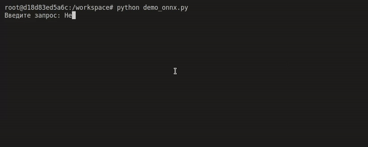
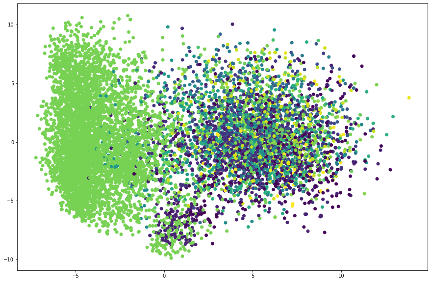
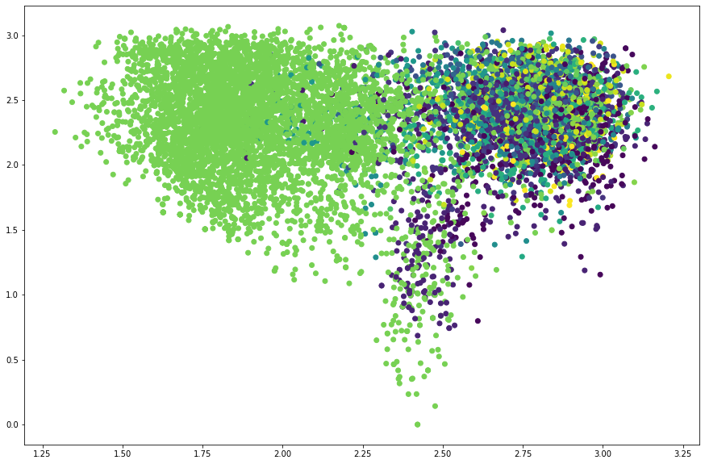

# Классификация сообщений

Этот репозиторий создан для решения задачи классификации сообщений неких пользователей некоего сервиса.

Предоставляю два подхода:
 -  Классификация на основе преобразования tf-idf вместе с градиентым бустингом (tfidf_catboost.ipynb)
 - Классификация с помощью нейронной сети bert-tiny (bert.ipynb)

## 

Также можно запустить демонстрацию работы нейросети bert-tiny.

Собрать и запустить docker контейнер:

```bash
docker build -t infolabs .
docker run -ti --rm infolabs 
```



wandb графики обучения нейросети: https://wandb.ai/outerspaceguy/infolabs

## P.S.

Решение ни в коем случае не использовать в проде! Оно является базовым показательным решением.

Достигнутые метрики очень просто улучшить, чуть больше поработав с чисткой данных и подбором гиперпараметров моделей.

## P.P.S.

"Респределение текстов, глазами нейросети ruBert-large"
 
